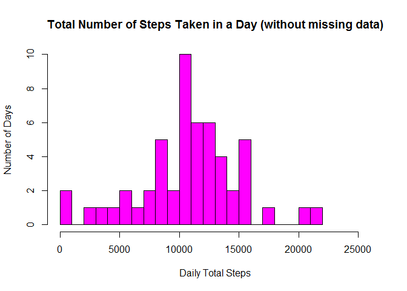
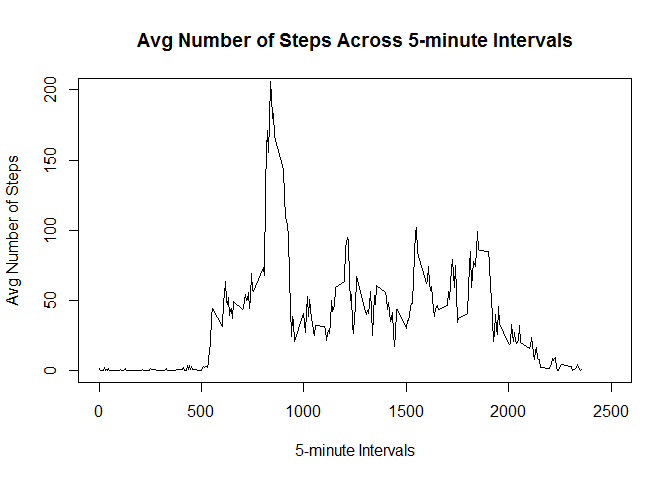
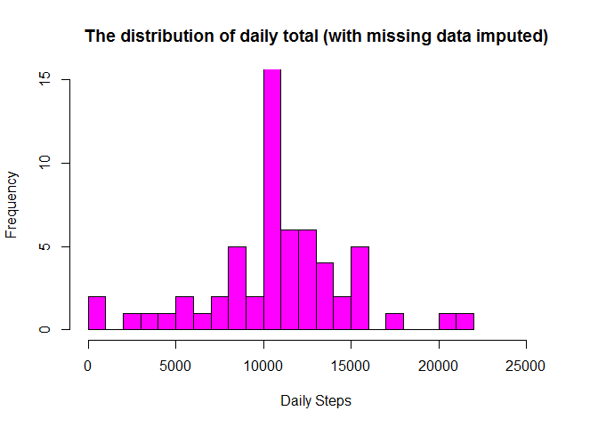
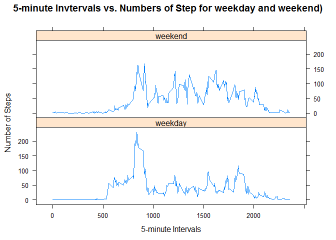

# Reproducible Research: Peer Assessment 1

## Loading and Preprocessing data


```r
# Load data

data <- read.csv("./data/activity.csv", head=TRUE, na.strings="NA")

# Process data 
# Correct type of date column and get rid of rows containing missing values.
# Save the subset to a new data frame "subData". 
# The original data frame is kept for later data imputation. 

data$date <- as.Date(data$date)
subData <- subset(data, !is.na(data$steps))
```

## What is the mean total number of steps taken per day?

```r
# Make a histogram of the total number of steps taken each day.
dailySum <- tapply(subData$steps, subData$date, sum, na.rm=TRUE, simplify=T)
dailySum <- dailySum[!is.na(dailySum)]

hist(x=dailySum,
     col="magenta",
     breaks=26,
     xlim = c(0,26000),
     ylim = c(0,10),
     xlab="Daily Total Steps",
     ylab="Number of Days",
     main="Total Number of Steps Taken in a Day (without missing data)")
```

 

```r
# Report the mean and median
mean(dailySum)
```

```
## [1] 10766.19
```

```r
median(dailySum)
```

```
## [1] 10765
```
## What is the average daily activity pattern?

```r
# Which 5-minute interval, on average across all the days, contains the maximum number of steps?
# Create a time series plot (i.e. type = "l") of the 5-minute interval (x-axis) and the average 
# number of steps taken, averaged across all days (y-axis)

avgStepInterval <- tapply(subData$steps, subData$interval, mean, na.rm=TRUE, simplify=T)
dataIntAvg <- data.frame(interval=as.integer(names(avgStepInterval)), avg=avgStepInterval)

with(dataIntAvg,
     plot(interval,
          avg,
          type="l",
          xlim = c(0,2500), 
          ylim = c(0,200),
          xlab = "5-minute Intervals",
          ylab = "Avg Number of Steps", 
          main = "Avg Number of Steps Across 5-minute Intervals"))
```

 

```r
# check which 5-minute interval, on average across all the days in the dataset, 
# contains the maximum number of steps:

maxSteps <- max(dataIntAvg$avg)
dataIntAvg[dataIntAvg$avg == maxSteps, ]
```

```
##     interval      avg
## 835      835 206.1698
```

```r
# It turns out that the interval 835 contains maximum number of steps 206
```

## Imputing missing values

```r
#Calculate and report the total number of missing values in the dataset 
#(i.e. the total number of rows with NAs)

sum(is.na(data$steps))
```

```
## [1] 2304
```

```r
#The original data set has 2304 rows with missing data.
#We use a simple strategy for filling in all of the missing values in the dataset. 
#If a 5-minute interval has missing value, we use the mean for that 5-minute interval.
#We create a new data frame df_impute that is equal to the original dataset but with 
#the missing data filled in (using mean for that interval for imputation):

dataImpute <- data
index <- is.na(dataImpute$steps)
dataIntAvg <- tapply(subData$steps, subData$interval, mean, na.rm=TRUE, simplify=T)
dataImpute$steps[index] <- dataIntAvg[as.character(dataImpute$interval[index])]

#Make a histogram of the total number of steps taken each day and calculate and report 
#the mean and median total number of steps taken per day.

newDailySum <- tapply(dataImpute$steps, dataImpute$date, sum, na.rm=TRUE, simplify=T)

hist(x=newDailySum,
     col="magenta",
     breaks=26,
     xlim = c(0,26000), 
     ylim = c(0,15),
     xlab="Daily Steps",
     ylab="Frequency",
     main="The distribution of daily total (with missing data imputed)")
```

 

```r
# find mean and median
mean(newDailySum)
```

```
## [1] 10766.19
```

```r
median(newDailySum)
```

```
## [1] 10766.19
```

```r
# Based on the imputed data set, the new mean is 10766 and the new median is 10766 . 
# Compare with the original mean 10766 and median 10765 , the mean doesn't change, 
# and the median has a small change. In fact, the new median becomes identical to the mean. 
# One possible explanation is that when we fill the missing data for the intervals, we use
# means for intervals, so we have more data close or identical to the means, and median is 
# shifted and becomes identical to the mean.

# The impact of imputing missing data on the estimates of the total daily number of steps 
# is also clear: now we have higher frequency counts in the histogram at the center region 
# (close to the mean).
```
##Are there differences in activity patterns between weekdays and weekends?

```r
# Create a new factor variable "week" in the dataset with two levels - "weekday" and "weekend" 
# indicating whether a given date is a weekday or weekend day.

# Decide if a day is a week day or not
day <- weekdays(dataImpute$date)
weekend <- (day == "Saturday" | day == "Sunday")
dayfactor <- factor(weekend, labels = list("weekday", "weekend"))
dataImpute$daytype <- dayfactor
head(dataImpute)
```

```
##       steps       date interval daytype
## 1 1.7169811 2012-10-01        0 weekday
## 2 0.3396226 2012-10-01        5 weekday
## 3 0.1320755 2012-10-01       10 weekday
## 4 0.1509434 2012-10-01       15 weekday
## 5 0.0754717 2012-10-01       20 weekday
## 6 2.0943396 2012-10-01       25 weekday
```

```r
# Make a panel plot containing a time series plot (i.e. type = "l") 
# of the 5-minute interval (x-axis) and the average number of steps taken, 
# averaged across all weekday days or weekend days (y-axis).

days <- weekdays(dataImpute$date)
weekend <- (days == "Saturday" | days == "Sunday")
dayfactor <- factor(weekend, labels = list("weekday", "weekend"))
dataImpute$daytype <- dayfactor
head(dataImpute)
```

```
##       steps       date interval daytype
## 1 1.7169811 2012-10-01        0 weekday
## 2 0.3396226 2012-10-01        5 weekday
## 3 0.1320755 2012-10-01       10 weekday
## 4 0.1509434 2012-10-01       15 weekday
## 5 0.0754717 2012-10-01       20 weekday
## 6 2.0943396 2012-10-01       25 weekday
```

```r
allData <- aggregate(dataImpute$steps, 
            list(DayType = dataImpute$daytype, 
            Interval = dataImpute$interval), mean)

library(lattice)
xyplot(allData$x ~ allData$Interval | allData$DayType, 
       layout = c(1,2),
       type = "l",
       xlab = "5-minute Intervals", 
       ylab = "Number of Steps", 
       main = "5-minute Invtervals vs. Numbers of Step for weekday and weekend)")
```

 
